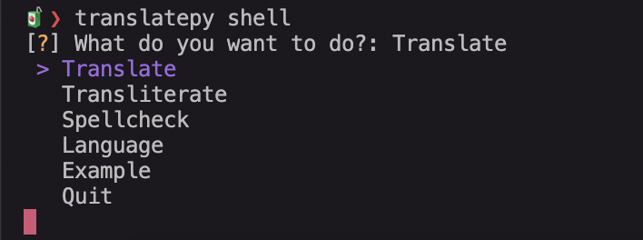

# Shell

The translatepy shell is a way of using translatepy right from your terminal.

It provides a simple TUI (Terminal User Interface) to easily translate things without opening any browser.

## Running the shell

You simply need to run the `translatepy shell` with the following optional arguments :

```swift
🧃❯ translatepy shell -h                         
usage: translatepy shell [-h] [--dest-lang DEST_LANG] [--source-lang SOURCE_LANG]

optional arguments:
  -h, --help            show this help message and exit
  --dest-lang DEST_LANG, -d DEST_LANG
                        destination language
  --source-lang SOURCE_LANG, -s SOURCE_LANG
                        source language
```

### Destination Language

`--dest-lang (-d)` lets you choose in which language you want to translate things when running the shell.

If not provided, it will interactively ask you to provide one when needed.

### Source Language

`--source-lang (-s)` lets you choose the input text language.

If not provided, it will be set as `auto` and will try to detect the input language.

## Action menu



Here you can choose what you want to do with translatepy.

### Translate

Will prompt you to enter an input text and will give you its translation.

You can enter `.quit` to exit the action.

### Transliterate

Will prompt you to enter a text to transliterate (get the pronunciation of).

You can enter `.quit` to exit the action.

### Spellcheck

Will correct/spellcheck the given text.

You can enter `.quit` to exit the action.

### Language

Will give you back the language of the given text.

You can enter `.quit` to exit the action.

### Example

Will return a list of examples.

You can enter `.quit` to exit the action.

### Quitting

You can quit the translatepy shell by selecting the `Quit` action.
